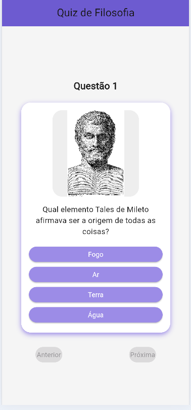
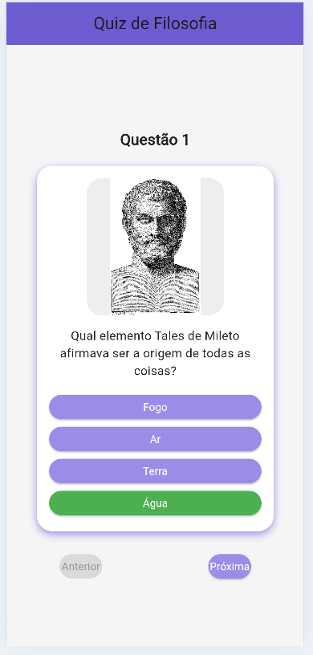
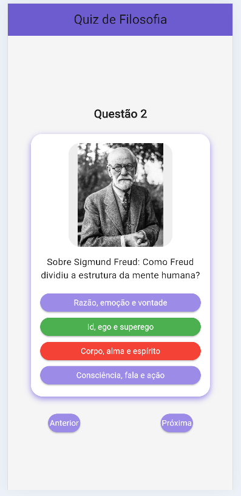

# Quiz de Filosofia

## Descrição do Projeto
Este projeto consiste em um aplicativo desenvolvido em Flutter que apresenta um quiz de filosofia com perguntas de múltipla escolha.  
As questões são carregadas a partir de um arquivo JSON local, permitindo fácil manutenção e organização dos dados.

O aplicativo possui interface moderna, com uso de imagens ilustrativas para cada questão, feedback visual de acertos e erros, além de uma tela final com a pontuação do usuário.

---

## Funcionalidades
- Exibição de perguntas com alternativas
- Uso de imagens para cada questão
- Sistema de pontuação automática
- Feedback visual (resposta correta/incorreta)
- Navegação entre questões
- Tela final com resultado
- Splash screen animado

---

## Tecnologias Utilizadas
- Flutter
- Dart
- JSON (mock de dados)
- VS Code ou Android Studio

---

## Prints das Telas
|  |  |  |  | [img](assets/imagens/foto5.png) |
|:-:|:-:|:-:|:-:|:-:|
| Tela Inicial | Questão | Caso Acerte | Caso Erre | Tela Final |
